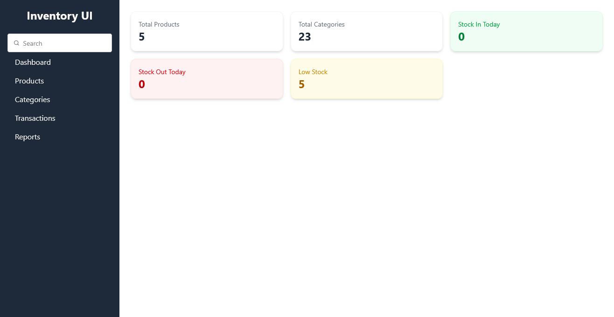
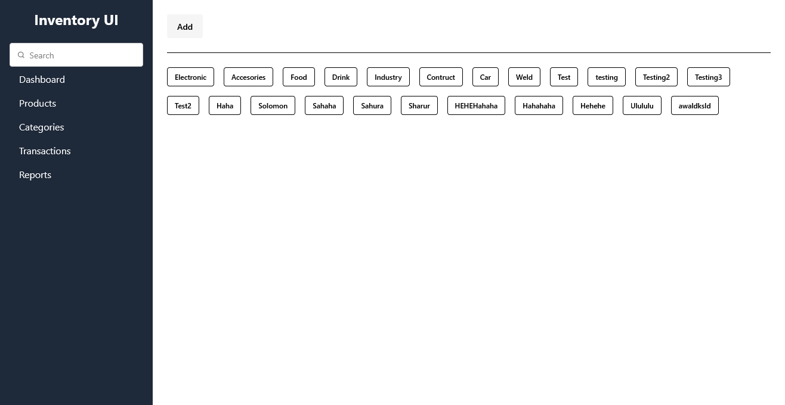
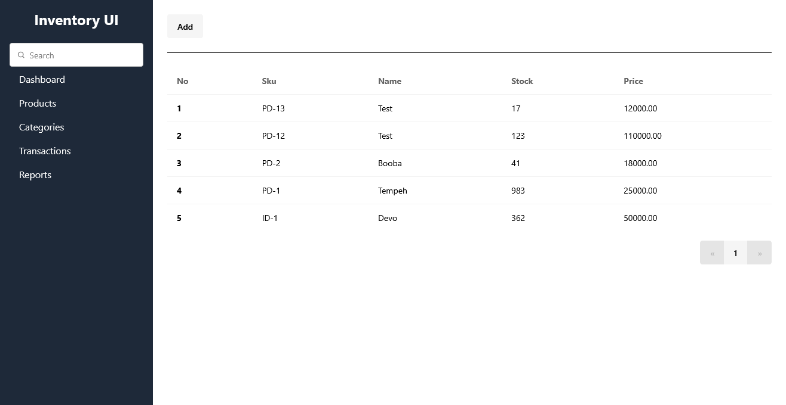
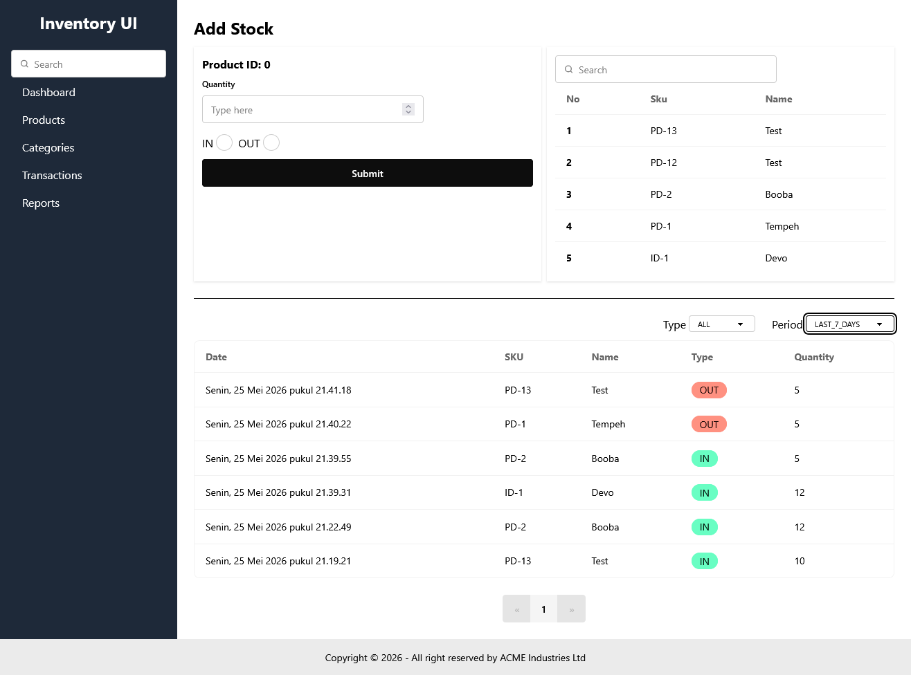

# Inventory Management UI

A modern inventory management application to manage products, categories, and stock transactions with an easy-to-use interface.

## 🎯 Main Features

- **Dashboard** - Stock summary and important statistics
- **Product Management** - Add, view, edit, and delete products
- **Category Management** - Organize products by categories
- **Track Transactions** - Monitor all stock inflows and outflows
- **Search** - Search products quickly
- **Responsive** - Works on desktop, tablet, and mobile devices

## 🛠️ Technology

- **Frontend**: Solid.js + Vite + Tailwind CSS
- **Language**: TypeScript
- **Package Manager**: Bun

## ⚙️ Requirements

- Node.js 18+ or Bun
- npm, yarn, or bun

## 🚀 How to Run

### 1. Download and navigate to the folder
```bash
git clone https://github.com/nurmanhadi/inventory-ui.git
cd inventory-ui
```

### 2. Create `.env` file
```bash
VITE_API_URL=example.com
```

### 3. Install dependencies
```bash
bun install
```

### 4. Run the application
```bash
bun run dev
```

### Build for production
```bash
bun run build
```

### Docker Deployment

#### Using Docker Compose (Recommended)
```bash
docker-compose up -d
```

The application will be available at http://localhost

#### Using Docker directly
```bash
# Build the image
docker build -t inventory-ui .

# Run the container
docker run -p 80:80 inventory-ui
```

#### Stop Docker container
```bash
# Using Docker Compose
docker-compose down

# Using Docker
docker stop inventory-ui
```

## 📁 Folder Structure

```
src/
├── apis/              → Connection to backend server
├── components/        → Display components
├── configs/           → Application settings
├── helpers/           → Helper functions
└── pages/             → Main pages
```

## 📱 Main Menu

**Dashboard** - View stock summary and statistics
- Total products
- Total categories
- Stock in today
- Stock out today

**Products** - Manage all products
- View product list
- Add new product
- Edit product information
- Delete product

**Categories** - Organize product categories
- View all categories
- Add new category
- Edit or delete category

**Transactions** - Monitor stock movement
- View transaction history
- Record stock in/out
- Filter by type and time

## 📸 Application Views

### Dashboard


### Categories


### Products


### Transactions


## 🔗 Connect to Server

The application connects to the backend server via API at:
- **Products**: `src/apis/products-api.ts`
- **Categories**: `src/apis/category-api.ts`
- **Transactions**: `src/apis/stock-api.ts`
- **Dashboard**: `src/apis/summary-api.ts`

## 📄 License

MIT - Free to use for personal or commercial purposes